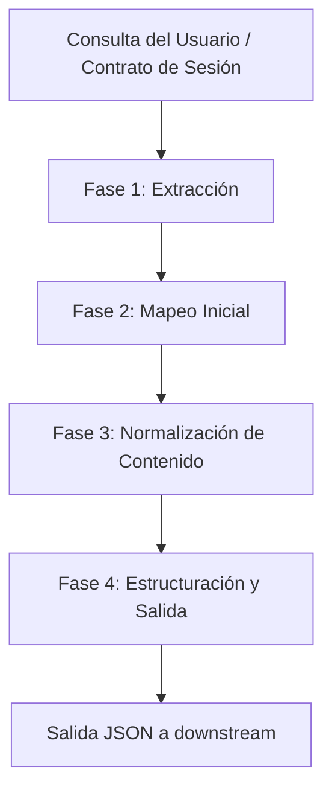

# Diseño del Pipeline de Ingesta: Scraper de arXiv (On-Demand)

Este documento define la arquitectura, el flujo de datos y las herramientas a utilizar para el scraper de la fuente arXiv dentro del proyecto Nabu. El componente está diseñado para operar de forma efímera (por sesión), sin persistencia de largo plazo, y con un fuerte enfoque en la normalización de texto para modelos de lenguaje.

## 1. Flujo General del Pipeline

El pipeline se ejecuta secuencialmente a través de las siguientes fases una vez que recibe una consulta (query) del usuario:



### Tabla de Mapeo y Transformación

| Campo de Origen (`arxiv.Result`) | Campo de Destino (Nabu) | Transformación / Normalización Requerida |
| :--- | :--- | :--- |
| `entry_id` | `landing_url` / `external_id` | Extraer el ID único (ej. `2401.12345v2`) de la URL para `external_id`. Mantener la URL completa para `landing_url`. |
| `title` | `title` | **Crucial:** Limpiar saltos de línea (replace `\n` con espacio) y pasar por `LatexNodes2Text` para decodificar LaTeX. |
| `summary` | `abstract` | **Crucial:** Igual que el título. Remover dobles espacios, saltos de línea crudos y procesar con `pylatexenc`. |
| `authors` | `authors` | Mapear a una lista de objetos: `[{"name": author.name, "affiliation": null}]`. |
| `pdf_url` | `pdf_url` | Almacenar directamente. |
| `categories` / `primary_category` | `categories` | Guardar como array de strings (ej. `["cs.LG", "cs.AI"]`). |
| `published` | `published_at` | Convertir el objeto `datetime` a formato string ISO 8601 (`YYYY-MM-DDTHH:MM:SSZ`). |
| `updated` | `updated_at` | Convertir a ISO 8601. |


## 4. Fase 4: Estructuración y Salida (Contrato Interno)

Una vez extraídos y normalizados, los datos se mapean a la estructura agnóstica de Nabu. Este esquema estándar permite a la capa de IA o a la aplicación consolidar fuentes (arXiv, Scholar, etc.) sin cambiar su lógica.

El objeto "Normalizado" que debe ser generado tendrá la siguiente estructura JSON:

```json
{
  "corpus_id": "sha256:arxiv:2401.12345v2", // Hash único o ID compuesto para identificar en la sesión
  "source": "arxiv",
  "external_id": "2401.12345v2",
  "title": "FlashAttention-3: Fast and Accurate Attention with Asynchrony and Low-precision",
  "abstract": "We present FlashAttention-3, an optimized attention kernel...", // LaTeX ya normalizado
  "authors": [
    {
      "name": "Jay Shah",
      "affiliation": null
    }
  ],
  "published_at": "2024-01-22T00:00:00Z",
  "updated_at": "2024-02-10T00:00:00Z",
  "landing_url": "https://arxiv.org/abs/2401.12345",
  "pdf_url": "https://arxiv.org/pdf/2401.12345.pdf",
  "categories": [
    "cs.LG",
    "cs.AI"
  ],
  "keywords": [], // A ser enriquecido post-procesamiento si se desea
  "venue": null, // Generalmente no disponible directamente vía arXiv metadata general
  "citation_count": null, 
  "snippet_is_partial": false,
  "authors_incomplete": false,
  "fetched_at": "2026-04-22T08:00:00Z" // Timestamp de la ejecución on-demand
}
```
